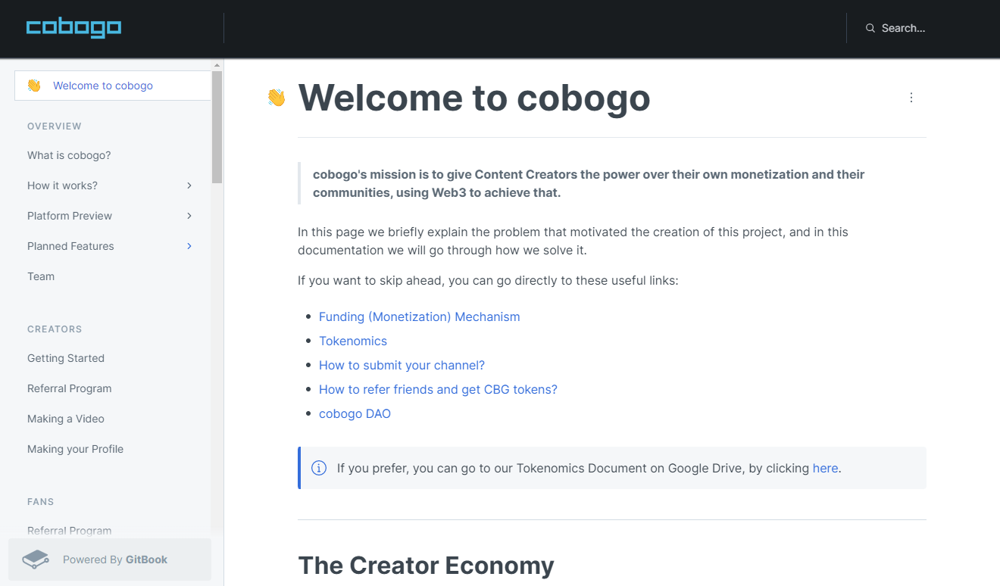
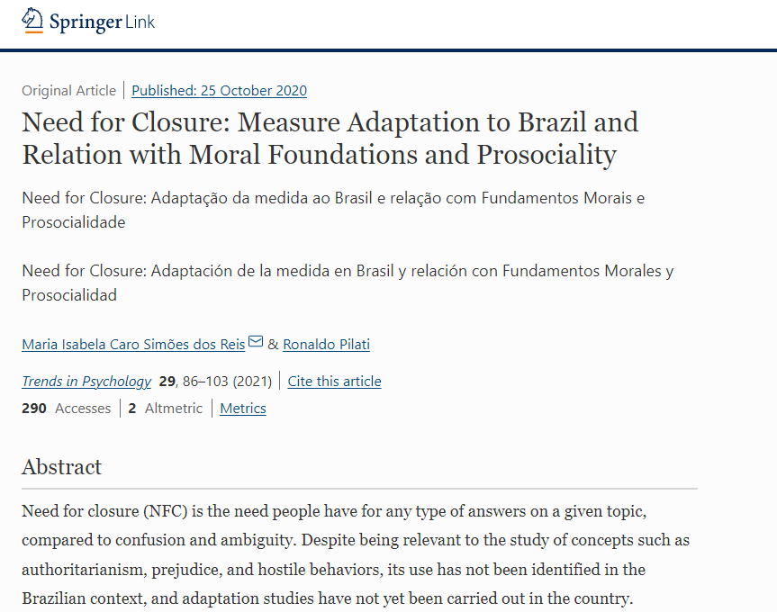

Hey, thanks for checking my portfolio out! Below are my technical documentation projects, Medium articles about Crypto, and a published Psychology article.
# cobogo
This [documentation](https://docs.cobogo.social/) introduces cobogo to users, and I am responsible for mantaining it. Cobogo is a platform made especially for Content Creators, that has the goal of giving them power over their own monetization and their communities, using Web3 to achieve that. It contains two major features, which are the **Creator Profiles**, and the **Split Yield Staking Mechanism**. The documentation includes but is not limited to:
* A description about every [major](https://docs.cobogo.social/overview/how-it-works) and [planned](https://docs.cobogo.social/overview/planned-features) features in the platform.
* Detailed information about the [Tokenomics](https://docs.cobogo.social/tokenomics/cbg-token), including the [token utility](https://docs.cobogo.social/tokenomics/token-utility), [emission](https://docs.cobogo.social/tokenomics/token-emission), [supply and distribution](https://docs.cobogo.social/tokenomics/supply-and-distribution).
* Getting started content for both [Creators](https://docs.cobogo.social/creators/getting-started) and [Fans](https://docs.cobogo.social/fans/referral-program), with quick-start tutorials that teach how to onboard the platform, and get a referral link in just a few clicks.
* A FAQ section about [Blockchain Basics](https://docs.cobogo.social/guides/blockchain-basics) that relate the most to the platform.
* [Weekly Updates](https://docs.cobogo.social/weekly-updates/weeks-1-10) section, updated every week with the project's development.

# Medium Articles
I have written several Medium articles for [cobogo](https://cobogo.social/) since I started working there as a Technical Writer, on December, 2021.

[What is cobogo?](https://medium.com/@cobogosocial/what-is-cobogo-7a895bfce3ea) First Introduction to cobogo, thoroughly contextualizing YouTube's pros and cons, and how cobogo fits as a solution to the cons. At this stage, cobogo was being developed as a dapp built on another project, [Dev Protocol](https://devprotocol.xyz/)

[cobogo: the Content Creator DAO.](https://medium.com/@cobogosocial/cobogo-the-content-creator-dao-ca9fbde0782) Description of cobogo's new scope, and announcement of the Pre-Seed roundo of investment.

[Empower your community through Social Tokens.](https://medium.com/@cobogosocial/empower-your-community-through-social-tokens-504484800836) Explanation of what are Social Tokens, how they can help a Creator build a community, why they haven't gone mainstream yet, and how you can mint your own.

[How to use Blockchain to support your favorite Content Creators.](https://medium.com/@cobogosocial/how-to-use-blockchain-to-support-your-favorite-content-creators-9ae2b04a0c38) Quick explanation about how to use the CBG, cobogo's native token, to support Creators, while earning interest.

[What is Staking?](https://medium.com/@cobogosocial/what-is-staking-286ded74e582) Easy to understand description of what it means to stake for someone, and why it is a good idea, in simple terms.

[Why is the number of likes on Social Media a metric of the past?](https://medium.com/@cobogosocial/why-is-the-number-of-likes-on-social-media-a-metric-of-the-past-ea1a2190a216) The importance of having real fans that support and engage with you, rather than having thousands of followers, and how Blockchain can help you profit more from this.

[Communities Strike Back: A Time for Content Creators' DAOs.](https://medium.com/@cobogosocial/communities-strike-back-a-time-for-content-creators-daos-590a036e0497) Characterization of what Decentralized Autonomous Organizations are, and how Content Creators can use them to empower their own community.

[NFTs by and for Content Creators: the power lies in the Communities.](https://medium.com/@cobogosocial/nfts-by-and-for-content-creators-73839ab0b7cf). Easily understandable definition of NFTs, and how cobogo will use them as a way to constantly monetize Content Creators.

[a16z's vision for the future of Web3: cobogo.](https://medium.com/@cobogosocial/a16zs-vision-for-the-future-of-web3-cobogo-e15dad2dea9d) Summary of the 2022 State of Crypto report that illustrates the transition from Web2 to Web3, and how some points presented compare to cobogo.

[What is a Media Kit and why you should have one (no matter what).](https://medium.com/@cobogosocial/what-is-a-media-kit-and-why-you-should-have-one-no-matter-what-bf57f33d482c) The importance of Media Kits as a way to raise awareness of one's personal brand and to close deals to collaborate with brands, and how cobogo plans on integrating that feature.

[Discover cobogo: Web3 Creator Monetization.](https://medium.com/@cobogosocial/discover-cobogo-web3-creator-monetization-965ff70732b8) Clarification of what cobogo is, including its new features and new scope.

[How being verified on-chain and off-chain can maximize your profit as a Content Creator.](https://medium.com/@cobogosocial/how-being-verified-on-chain-and-off-chain-can-maximize-your-profit-as-a-content-creator-7bc350af2c1) The benefits of the verification badge, especially to increase a Creator's credibility and trustworthiness.

[How to make money on the Internet as an artist.](https://medium.com/@cobogosocial/how-to-make-money-on-the-internet-as-an-artist-ca851167c5fa) Description of a few ways in which artists can make revenue on the internet, including NFTs and DeFi.

[Yield-Bearing NFTs for Creators' continuous monetization.](https://medium.com/@cobogosocial/yield-bearing-nfts-for-creators-continuous-monetization-94dcd65d8801) "New" use of NFTs as proof of continuous, that is, as a digital representation of a staking position in a Creator's pool.

# Psychology
I have been conducting research and writing research papers in Psychology for a while, due to my Masters and PhD in Social, Work, and Organization Psychology. 
I have published an [article](images/Scientific-Article.pdf) about Need for Closure, Morality, and Prosocial Behavior in a [scientific journal](https://link.springer.com/article/10.1007/s43076-020-00047-x), and I'm currently in the peer reviewing proccess to publish another.

# Translation
I also occasionally translate some texts to both Portuguese and Spanish. This includes:
* Landing pages ([PT](https://cobogo.social/pt)/[ES](https://cobogo.social/es))
* FAQs ([PT](https://cobogo.social/pt/faq)/[ES](https://cobogo.social/es/faq))
* Codes of conduct ([PT](https://cobogo.social/pt/code)/[ES](https://cobogo.social/es/code))
* Privacy policies ([PT](https://cobogo.social/pt/privacy)/[ES](https://cobogo.social/es/privacy))
* Terms of use ([PT](https://cobogo.social/pt/terms/)ES)
* Research articles' abstracts
* Psychological measuring instruments

